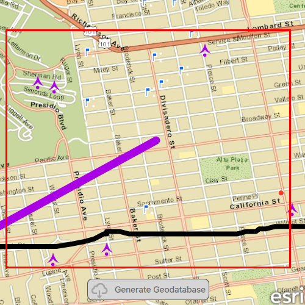

#Generate geodatabase

This sample demonstrates how to take a feature service offline by generating a geodatabase.

##How it works

Pan and zoom into the desired area, making sure the area you want to take offline is within the red rectangle. Tap on the `Generate Geodatabase` button, and this will call `generateGeodatabase`, which will return a job. The job must be started manually, and once started can be canceled at anytime. Once the job completes successfully, feature layers are created with the output feature tables (which are obtained from the result geodatabase), and the layers are added to the map.

##Features
- Map
- MapView
- ArcGISTiledLayer
- TileCache
- FeatureLayer
- ServiceFeatureTable
- GeodatabaseFeatureTable
- GeodatabaseSyncTask
- GenerateGeodatabaseParameters
- GenerateLayerOption
- GenerateGeodatabaseJob

##Offline Data
Read more about how to set up the sample's offline data [here](http://links.esri.com/ArcGISRuntimeQtSamples).

Link | Local Location
---------|-------|
|[San Francisco Streets TPK](https://www.arcgis.com/home/item.html?id=3f1bbf0ec70b409a975f5c91f363fe7d)| `<userhome>`/ArcGIS/Runtime/Data/tpk/SanFrancisco.tpk |
