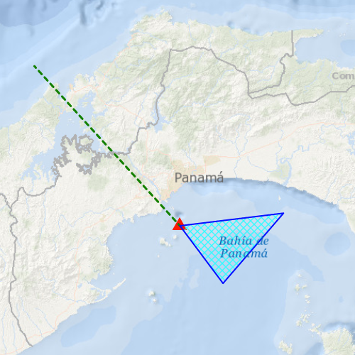

#Feature collection layer

This samples demonstrates how to create a new feature collection with several feature collection tables. The collection is displayed in the map as a feature collection layer.

##How it works
A `FeatureCollectionLayer` is created from a `FeatureCollection` and is added to the map's operational layers. Then, a point `FeatureCollectionTable`, a polyline `FeatureCollectionTable`, and a polygon `FeatureCollectionTable` are created, and their schemas and renderers are defined. Next, features are added to each table, and each table is added to the FeatureCollection. In this case, hardcoded features are added to the tables for display on the map. However, a common use case is to read a CSV or some other data source, and to popuplate the table with the attributes and geometry provided in the external data source.

##Features
- FeatureCollection
- FeatureCollectionLayer
- FeatureCollectionTable
- Field
- Feature
- SimpleRenderer
- SimpleMarkerSymbol
- SimpleLineSymbol
- SimpleFillSymbol