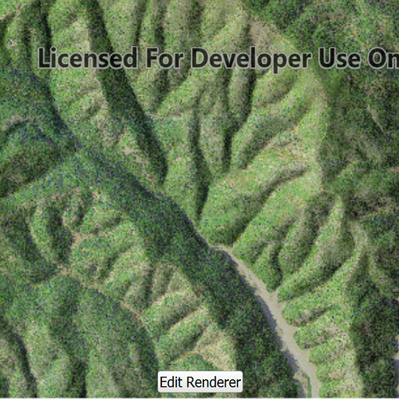

# RGB Renderer

This sample demonstrates how to use blend renderer on a raster layer.
You can get a hillshade blended with either a colored raster or color ramp.

## How it works
- Tap on the "Edit Renderer" button in the toolbar to change the settings for the blend renderer.
- The sample allows you to change the altitude, azimuth, alope type and color ramp type.
- You can tap on the "Render" button to update the raster.
- If you use "none" as the color ramp type, the colored raster is blended with the hillshade output.
- For all the other types a color ramp is used.

## Features
- `Map`
- `MapQuickView`
- `Raster`
- `RasterLayer`
- `BlendRenderer`

## Offline Data
Read more about how to set up the sample's offline data [here](http://links.esri.com/ArcGISRuntimeQtSamples).

Link | Local Location
---------|-------|
|[Shasta.tif raster](https://www.arcgis.com/home/item.html?id=c669445e6cb4490b8306f0c170a9cbb1)| `<userhome>`/ArcGIS/Runtime/Data/raster/Shasta.tif |
|[Shasta_Elevation.tif raster](https://www.arcgis.com/home/item.html?id=b051f5c3e01048f3bf11c59b41507896)| `<userhome>`/ArcGIS/Runtime/Data/raster/Shasta_Elevation.tif |
