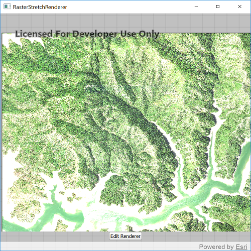

# Stretch renderer

This sample demonstrates how to use stretch renderer on a raster layer.

## How to use the sample
- Tap on the "Edit renderer" button to change the settings for the stretch renderer.
- The sample allows you to change the stretch type and the parameters for each type. You can tap on the Render button to update the raster.

## How it works
To apply a `StretchRenderer` to a `RasterLayer`:

- Create a `Raster` from a raster file.
- Create a `RasterLayer` from the raster.
- Create a `Basemap` from the raster layer and set it to the map.
- Create a `StretchRenderer`, specifying the `StretchParameters` and other properties.
- Set the renderer on the raster layer with `rasterLayer.renderer = renderer`.

## Features
- `Map`
- `MapView`
- `Raster`
- `RasterLayer`
- `StretchRenderer`

## Offline Data
Read more about how to set up the sample's offline data [here](http://links.esri.com/ArcGISRuntimeQtSamples).

Link | Local Location
---------|-------|
|[ShastaBW.tif raster](https://www.arcgis.com/home/item.html?id=cc68728b5904403ba637e1f1cd2995ae)| `<userhome>`/ArcGIS/Runtime/Data/raster/ShastaBW.tif |
